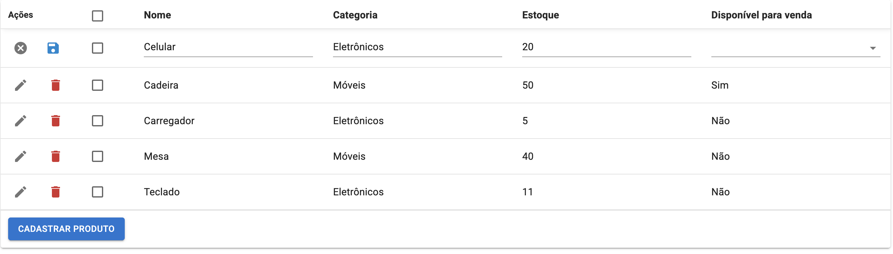

# Avaliação Técnica - Desenvolvimento Full Stack

Este projeto foi desenvolvido como resposta ao desafio técnico proposto, implementando uma lista com scroll infinito e funcionalidades de ações em massa seguindo os requisitos especificados.

## Tecnologias Utilizadas

### Frontend
- **React 18**: Biblioteca principal para construção da interface
- **Material-UI (MUI) v5**: Componentes UI e sistema de design
- **Tanstack-Table**: Para renderização eficiente de listas grandes
- **React Query**: Gerenciamento de estado e cache de dados
- **Axios**: Cliente HTTP para comunicação com a API

### Backend
- **NestJS 10**: Framework para construção da API
- **TypeORM**: ORM para integração com PostgreSQL
- **PostgreSQL 15**: Banco de dados relacional
- **class-validator**: Validação de dados
- 
## Funcionalidades Implementadas

### 1. Listagem com Scroll Infinito
- Carregamento paginado de itens
- Renderização virtualizada para performance
- Loading state durante o carregamento

### 2. Ações em Massa
- Seleção múltipla de itens com checkboxes
- Modal de confirmação para ações em massa
- Sistema de deseleção automática após ação
- Suporte para múltiplos tipos de ações (ex: deletar/ativar/desativar)

### 3. Ações Individuais
- Edição inline do item
- Alternância de status individual
- Feedback visual imediato das alterações

### 4. Interface de Usuário
- Design responsivo e acessível
- Barra de ferramentas contextual para ações em massa
- Snackbars para feedback de operações

## Instruções para Execução do Projeto

### Pré-requisitos

- Node.js instalado (versão 16 ou superior)
- npm ou yarn instalado

## Rotas Backend

- `GET /products` - Listar todos os produtos
- `GET /products/id` - Buscar um produto
- `GET /products?page=1&limit=10/` - Listar produtos com paginação
- `POST /products` - Criar um produto
- `PUT /products/id` - Editar um produto
- `DELETE /products` - Deletar um produto
- `DELETE /products/bulk-delete?ids=1,2,3` - Deletar vários produtos
- `PUT /products/bulk-update?ids=64,65,66&availableForSale=false` - Atualizar a disponibilidade de vários produtos

### Passos para Execução

1. **Clone o repositório**:
   ```bash
   git clone https://github.com/lucasrguidi/teceo-list-project
   cd teceo-list-project
   ```

2. **Instale as dependências**:
 ```bash
   # front-end
   cd react-frontend
   npm install
   # back-end
   cd nestjs-backend
   npm install
   ```

3. **Configure as variáveis de ambiente**:
	Crie um arquivo `.env` na raiz do projeto front-end e adicione as seguintes variáveis:
 ```bash
 # front-end
   VITE_API_URL=http://localhost:3000/
   ```
Crie um arquivo `.env` na raiz do projeto back-end e adicione as seguintes variáveis:
 ```bash
 # back-end
   DATABASE_HOST=db
   DATABASE_PORT=5432
   DATABASE_USER=teceo
   DATABASE_PASSWORD=teceo
   DATABASE_NAME=teceo_db
   ```

4. **Suba os containers com Docker Compose no backend:**
   ```bash
   docker-compose up --build
	```

5. Inicie o servidor de desenvolvimento no frontend:
   ```bash
   npm run dev
	```


3. Acesse a aplicação:
   ```bash
   http://localhost:3000
	```

## Screenshots

**Tela Padrão**


**Edição Inline**



**Cadastro de produto inline**


**Confirmação de exclusão**


**Confirmação de ação em massa**


## Considerações Finais

O projeto foi desenvolvido com foco em boas práticas de engenharia de software, priorizando:

- Manutenibilidade do código
    
- Performance de execução
    
- Experiência do usuário final
    
- Escalabilidade da arquitetura

